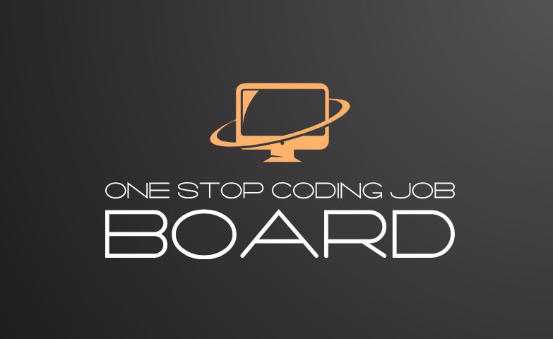
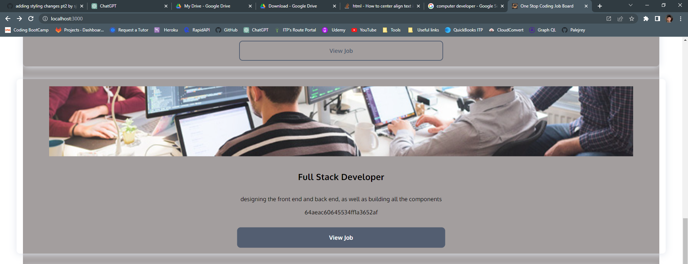
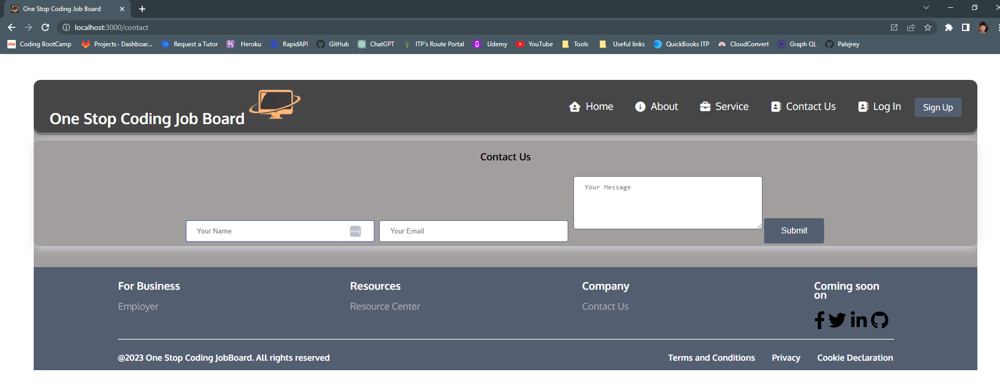
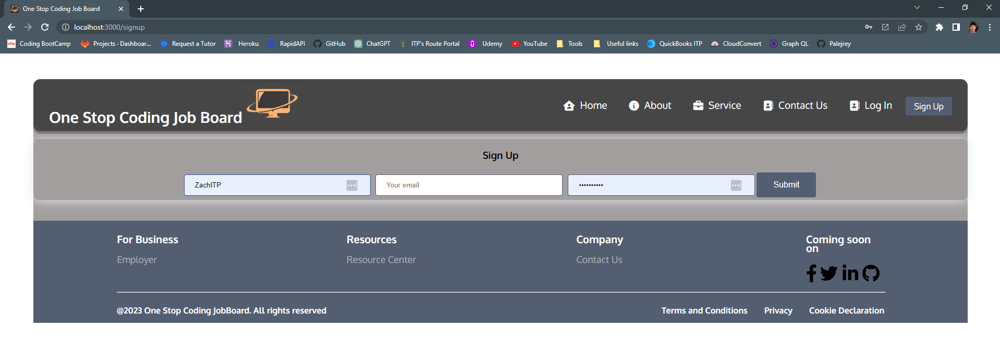

# One Stop Coding Job Board

#### By Zach, Reynaldo, Scott

## Description
One Stop Coding Job Board was developed by developers for developers who are entering the job market. Our goal is to deliver a easy to use webpage that has a full listing of jobs as well as acting as a forum for people to post joibs that they have found.

## Purpose

We wanted a streamlined easy to use website for developers to find jobs and post jobs without having to sift through jobs that are not relivent to their career field. This platform is for developers and coders, we are very specialized 

## Technologies Used

* JavaScript
* CSS
* HTML
* Heroku
* Atlas 
* React
* Apollo-server
* Express
* Graphql
* Mongoose
* Lodash
* Nodemon

## Website

Check out our Github repository https://github.com/Palejrey/OneStopCodingJobBoard

Checkout our website on Heroku: https://codingjobboard-d93ad0d875e7.herokuapp.com/

# The Team

Zach Hanson:    https://github.com/ZachITP

Scott Bossard:  https://github.com/sjbossa

Reynaldo Velez: https://github.com/Palejrey

## License

MIT Copyright (c) 2023 Zach/Reynaldo/Scott

Permission is hereby granted, free of charge, to any person obtaining a copy of this software and associated documentation files (the "Software"), to deal in the Software without restriction, including without limitation the rights to use, copy, modify, merge, publish, distribute, sublicense, and/or sell copies of the Software, and to permit persons to whom the Software is furnished to do so, subject to the following conditions:

The above copyright notice and this permission notice shall be included in all copies or substantial portions of the Software.

THE SOFTWARE IS PROVIDED "AS IS", WITHOUT WARRANTY OF ANY KIND, EXPRESS OR IMPLIED, INCLUDING BUT NOT LIMITED TO THE WARRANTIES OF MERCHANTABILITY, FITNESS FOR A PARTICULAR PURPOSE AND NONINFRINGEMENT. IN NO EVENT SHALL THE AUTHORS OR COPYRIGHT HOLDERS BE LIABLE FOR ANY CLAIM, DAMAGES OR OTHER LIABILITY, WHETHER IN AN ACTION OF CONTRACT, TORT OR OTHERWISE, ARISING FROM, OUT OF OR IN CONNECTION WITH THE SOFTWARE OR THE USE OR OTHER DEALINGS IN THE SOFTWARE.
